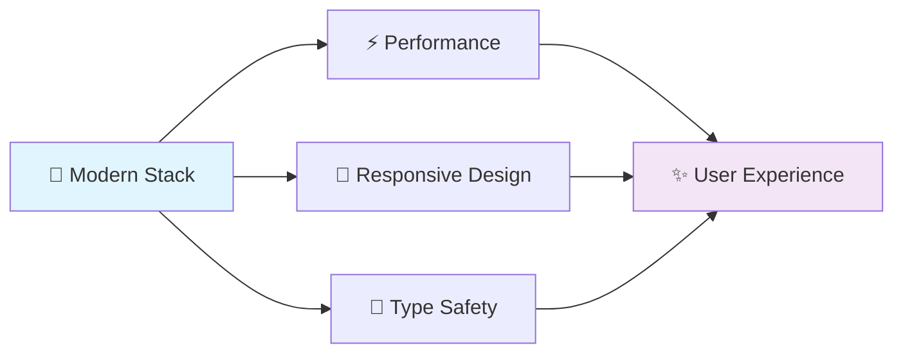
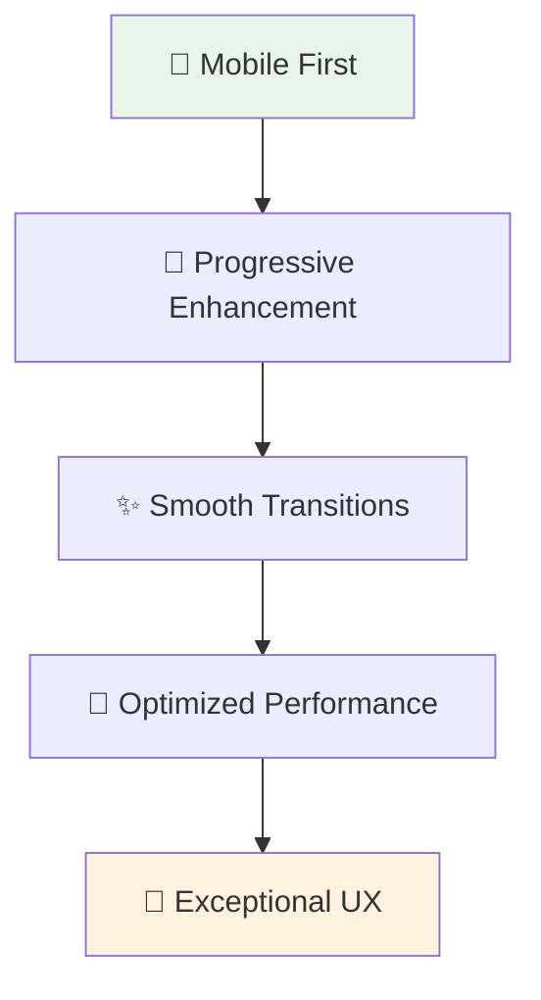

<div align="center">

# 🚀 TechSpire Team - Portfolio Showcase

[](https://github.com/hey-avi/techspire-team/actions/workflows/deploy.yml)


*A professional sample showcase portfolio demonstrating modern web development techniques and team collaboration*

**🎯 Built with precision • 🎨 Crafted with passion • 🌟 Designed for excellence**

</div>

---

## 📋 About This Project

> **🎨 Showcase Excellence** | This is a **sample showcase portfolio** created by **Team Shivaay** to demonstrate proficiency in modern web development technologies and best practices.

<table>
<tr>
<td width="50%">

### 🎯 **Purpose**
- Professional portfolio template
- Modern web development showcase  
- Team collaboration demonstration
- Best practices implementation

</td>
<td width="50%">

### ✨ **Highlights**
- Clean, professional design
- Dark/Light mode support
- Smooth animations & transitions
- Responsive layouts for all devices

</td>
</tr>
</table>

## 🚀 Key Features

<div align="center">

| 🎯 **Development** | 🎨 **Design** | 📱 **Experience** | 🔧 **Tools** |
|:---:|:---:|:---:|:---:|
| ⚡ **Vite** Build Tool | 🎨 **Tailwind CSS** | 📱 **Mobile-First** | 🎯 **TypeScript** |
| 🏗️ **Component Architecture** | 🌓 **Dark/Light Mode** | ✨ **Smooth Animations** | 🔄 **CI/CD Pipeline** |

</div>

### 🌟 **Core Capabilities**



- **⚡ Lightning Fast**: Built with Vite for optimal development experience
- **🎨 Pixel Perfect**: Crafted with Tailwind CSS for seamless cross-device compatibility  
- **🌓 Theme Magic**: Elegant dark/light mode toggle functionality
- **✨ Smooth Motion**: Enhanced user experience with Framer Motion
- **📱 Universal Design**: Optimized for all screen sizes and devices
- **🎯 Rock Solid**: Full TypeScript implementation for robust code quality
- **🔄 Automated**: CI/CD pipeline with GitHub Actions
- **🏗️ Modular**: Clean component architecture for maintainability

## 🛠️ Technology Stack

<div align="center">

### **🎯 Frontend Powerhouse**

| Technology | Purpose | Version | Badge |
|:----------:|:-------:|:-------:|:-----:|
| **⚛️ React** | Frontend Framework | `^18.x` |  |
| **📘 TypeScript** | Type Safety & Development | `^5.x` |  |
| **🎨 Tailwind CSS** | Styling & Design System | `^3.x` |  |
| **✨ Framer Motion** | Animations & Transitions | `^11.x` |  |
| **⚡ Vite** | Build Tool & Dev Server | `^5.x` |  |
| **🔄 GitHub Actions** | CI/CD & Deployment | `Latest` |  |

</div>

<details>
<summary><b>🔧 Development Tools & Dependencies</b></summary>

```json
{
  "build": "vite",
  "dev": "vite",
  "preview": "vite preview",
  "type-check": "tsc --noEmit",
  "lint": "eslint . --ext ts,tsx",
  "format": "prettier --write ."
}
```
</details>

## 📦 Getting Started

<div align="center">

### 🚀 **Quick Start Guide**

</div>

### 📋 Prerequisites

<table>
<tr>
<td>

**🟢 Node.js**
```bash
v18.0.0 or higher
```

</td>
<td>

**📦 Package Manager**
```bash
npm v8.0.0+ or yarn
```

</td>
<td>

**🌐 Git**
```bash
Version control
```

</td>
</tr>
</table>

### ⚡ Installation & Setup

<details>
<summary><b>🔧 Step-by-Step Installation</b></summary>

#### 1️⃣ **Clone the repository**
```bash
git clone https://github.com/hey-avi/techspire-team.git
cd techspire-team
```

#### 2️⃣ **Install dependencies**
```bash
# Using npm
npm install

# Using yarn
yarn install
```

#### 3️⃣ **Start development server**
```bash
# Using npm
npm run dev

# Using yarn  
yarn dev
```

#### 4️⃣ **Build for production**
```bash
# Using npm
npm run build

# Using yarn
yarn build
```

#### 5️⃣ **Preview production build**
```bash
# Using npm
npm run preview

# Using yarn
yarn preview
```

</details>

### 🎯 **Available Scripts**

| Command | Description | Usage |
|---------|-------------|-------|
| `dev` | 🚀 Start development server | `npm run dev` |
| `build` | 📦 Build for production | `npm run build` |
| `preview` | 👀 Preview production build | `npm run preview` |
| `lint` | 🔍 Run ESLint | `npm run lint` |
| `type-check` | 📘 Check TypeScript | `npm run type-check` |

## 🔧 Configuration

### Environment Variables

Create a `.env` file in the root directory:

```env
VITE_APP_TITLE=TechSpire Team
```

### TypeScript Configuration

The project uses two TypeScript configuration files:
- `tsconfig.json` - Main TypeScript configuration
- `tsconfig.node.json` - Configuration for Vite and Node.js

## 📂 Project Architecture

<div align="center">

### 🏗️ **Clean & Organized Structure**

</div>

<details>
<summary><b>📁 Complete File Structure</b></summary>

```
📦 techspire-team/
├── 📁 public/                    # 🖼️ Static Assets
│   └── 📁 images/               # 🎨 Image Resources
│       ├── irctc-thumb.svg      # 🚆 Project Thumbnails
│       └── techspire-thumb.svg  # 🚀 Brand Assets
├── 📁 src/                      # 💻 Source Code
│   ├── 📁 components/           # 🧩 Reusable UI Components
│   │   ├── 📁 Contact/         # 📧 Contact Section
│   │   ├── 📁 Hero/            # 🎯 Hero Section  
│   │   ├── 📁 MemberProfile/   # 👤 Team Profiles
│   │   ├── 📁 Navbar/          # 🧭 Navigation
│   │   ├── 📁 ProjectShowcase/ # 🎨 Project Display
│   │   ├── 📁 Roadmap/         # 🗺️ Roadmap Visualization
│   │   └── 📁 TeamSection/     # 👥 Team Information
│   ├── 📁 context/             # 🔄 React Context
│   │   └── ThemeContext.tsx    # 🌓 Theme Management
│   ├── 📁 styles/              # 🎨 Global Styles
│   │   └── index.css           # 📝 Main Stylesheet
│   ├── 📁 types/               # 📘 TypeScript Definitions
│   │   ├── project.ts          # 🛠️ Project Types
│   │   ├── roadmap.ts          # 🗺️ Roadmap Types
│   │   ├── team.ts             # 👥 Team Types
│   │   └── theme.ts            # 🌓 Theme Types
│   ├── 📁 utils/               # 🔧 Utility Functions
│   │   └── constants.ts        # 📋 App Constants
│   ├── App.tsx                 # 🎯 Main App Component
│   └── main.tsx                # 🚀 Entry Point
├── 📁 .github/                 # 🔄 GitHub Configuration
│   └── 📁 workflows/           # ⚙️ CI/CD Pipelines
├── 📄 index.html               # 🌐 HTML Template
├── 📄 package.json             # 📦 Dependencies
├── 📄 tailwind.config.js       # 🎨 Tailwind Config
├── 📄 tsconfig.json            # 📘 TypeScript Config
├── 📄 vite.config.ts           # ⚡ Vite Configuration
└── 📄 README.md                # 📖 Documentation
```

</details>

### 🎯 **Architecture Highlights**

<table>
<tr>
<td width="33%">

**🧩 Component-Based**
- Modular design
- Reusable components
- Clean separation of concerns

</td>
<td width="33%">

**📘 Type-Safe**
- Full TypeScript integration
- Strict type checking
- Better developer experience

</td>
<td width="33%">

**🎨 Design System**  
- Consistent styling
- Theme management
- Responsive design

</td>
</tr>
</table>

## 🎨 Customization Guide

### Theme Configuration

Customize the visual theme in `tailwind.config.js`:

```javascript
module.exports = {
  theme: {
    extend: {
      colors: {
        primary: {
          50: '#f0f9ff',
          500: '#3b82f6',
          900: '#1e3a8a',
        },
        // Add custom color palette
      },
      fontFamily: {
        sans: ['Inter', 'system-ui', 'sans-serif'],
        // Add custom fonts
      }
    }
  }
}
```

### Team Member Configuration

Update team information in the respective component files:

```typescript
// Example team member structure
interface TeamMember {
  name: string;
  role: string;
  email: string;
  bio: string;
  skills: string[];
  social: {
    github?: string;
    linkedin?: string;
    twitter?: string;
  };
}
```

## 📱 Responsive Design Philosophy

<div align="center">

### 📐 **Mobile-First Approach**

*Crafted with precision for every screen size*

</div>

<table>
<tr>
<td align="center">

**📱 Mobile**  
`0 - 639px`  
Touch-optimized

</td>
<td align="center">

**📲 Tablet**  
`640px - 1023px`  
Balanced layout

</td>
<td align="center">

**💻 Desktop**  
`1024px - 1279px`  
Full experience

</td>
<td align="center">

**🖥️ Large Desktop**  
`1280px+`  
Enhanced visuals

</td>
</tr>
</table>

### 🎯 **Design Principles**



<details>
<summary><b>🔧 Technical Implementation</b></summary>

- **Touch Interactions**: Optimized for mobile gestures
- **Screen Densities**: Support for retina and high-DPI displays  
- **Fluid Typography**: Responsive font scaling
- **Flexible Layouts**: CSS Grid and Flexbox
- **Image Optimization**: WebP support with fallbacks

</details>

## 🚀 Deployment & CI/CD

### Automated Deployment

The project features automated deployment to GitHub Pages using GitHub Actions. The workflow triggers on:
- Push to `main` branch
- Pull request merges
- Manual workflow dispatch

### Manual Deployment

For manual deployment or custom hosting:

```bash
# Build the project
npm run build

# The built files will be in the 'dist' directory
# Deploy these files to your preferred hosting service
```

### Environment Variables

For custom deployments, you may need to configure:

```env
# .env (optional)
VITE_APP_TITLE=Your Team Name
VITE_BASE_URL=your-domain.com
```

## 🤝 Development Guidelines

### Contributing

We welcome contributions to improve this showcase portfolio. Please follow these guidelines:

1. **Fork the repository** and create your feature branch:
   ```bash
   git checkout -b feature/enhancement-name
   ```

2. **Follow coding standards:**
   - Use TypeScript for type safety
   - Follow the existing code style and conventions
   - Write meaningful commit messages
   - Add appropriate comments for complex logic

3. **Test your changes:**
   - Ensure the build process completes successfully
   - Test responsive design across different devices
   - Verify dark/light mode functionality

4. **Submit your changes:**
   ```bash
   git commit -m 'Add: Brief description of changes'
   git push origin feature/enhancement-name
   ```

5. **Create a Pull Request** with a detailed description of your changes

### Code Quality Standards

- **ESLint**: Follow the configured linting rules
- **Prettier**: Code formatting is automatically handled
- **TypeScript**: Maintain strict type checking
- **Component Structure**: Keep components focused and reusable

## 📄 License

<div align="center">

### 🔒 **Proprietary License**


**This project is proprietary software owned by Team Shivaay**  
*All rights reserved*

📋 [**View Complete License Terms**](LICENSE)

</div>

## 🔄 Project Status

<div align="center">

| Status | Version | Updated | Maintainers |
|:------:|:-------:|:-------:|:-----------:|
|  |  |  |  |

</div>  

## 👥 Team Shivaay

<div align="center">

### 🌟 **Meet the Creators**

*Passionate developers crafting exceptional digital experiences*

</div>

<table>
<tr>
<td align="center" width="33%">

### 👨‍💻 **Avinash Meena**
**Lead Developer & Project Manager**

[](mailto:avinash.meena2023@glbajajgroup.org)

*🚀 Visionary leader driving technical excellence*

</td>
<td align="center" width="33%">

### 👩‍🎨 **Neha Kumari**  
**Frontend Developer & UI Designer**

[](mailto:neha.kumari2023@glbajajgroup.org)

*🎨 Creative force behind beautiful interfaces*

</td>
<td align="center" width="33%">

### 👨‍🔧 **Deepak Verma**
**Full-Stack Developer & DevOps**

[](mailto:deepak.verma2023@glbajajgroup.org)

*⚙️ Technical architect ensuring seamless deployment*

</td>
</tr>
</table>

---

<div align="center">

### 📧 **Get In Touch**

*For inquiries, collaboration opportunities, or support regarding this project*

[](mailto:avinash.meena2023@glbajajgroup.org,neha.kumari2023@glbajajgroup.org,deepak.verma2023@glbajajgroup.org)

**🤝 We'd love to hear from you!**

</div>

## 🙏 Acknowledgments & Credits

<div align="center">

### 💝 **Special Thanks**

*Standing on the shoulders of giants*

</div>

<table>
<tr>
<td align="center" width="20%">

[](https://reactjs.org/)  
**React Team**  
*Exceptional frontend framework*

</td>
<td align="center" width="20%">

[](https://tailwindcss.com/)  
**Tailwind CSS**  
*Utility-first CSS framework*

</td>
<td align="center" width="20%">

[](https://www.framer.com/motion/)  
**Framer Motion**  
*Beautiful animations*

</td>
<td align="center" width="20%">

[](https://vitejs.dev/)  
**Vite**  
*Lightning-fast build tool*

</td>
<td align="center" width="20%">

[](https://www.typescriptlang.org/)  
**TypeScript**  
*Enhanced developer experience*

</td>
</tr>
</table>

<div align="center">

**🌍 Open Source Community** • **📚 Continuous Learning** • **💡 Endless Inspiration**

</div>

---

<div align="center">

# 💖 **Built with Love by Team Shivaay**

*This project serves as a demonstration of modern web development practices and team collaboration skills*


**🚀 Crafting the future, one line of code at a time**

[](https://github.com/hey-avi/techspire-team)

</div>
